---
title-slide-attributes:
- data-background-image: /assets/intro.jpg
- data-background-size: cover
- data-background-opacity: 0.18
- data-background-color: aquamarine
title: Evaluación y cultura de aula en matemáticas
subtitle: 
author: <a href="www.tierradenumeros.com">Pablo Beltrán-Pellicer </a>   Universidad de Zaragoza     2do Encuentro virtual MatEduMat - La investigación y el aula de matemáticas    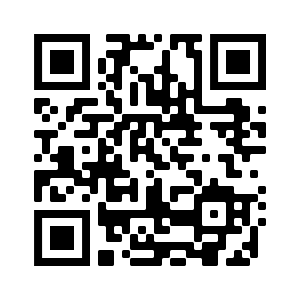    <a href="https://pbeltran.github.io/2021matedumateval">https://pbeltran.github.io/2021matedumateval</a>   18 de septiembre de 2021    
rollingLinks: true
description: Materiales distribuidos bajo licencia CC-BY-SA-4.0 

---

# Introducción {data-background-image="assets/intro.jpg" data-background-opacity="0.22"}

## La evaluación como calificación o la calificación como evaluación {data-background-image="assets/intro.jpg" data-background-opacity="0.18"}

{width=60%}

## {data-background-image="assets/intro.jpg" data-background-opacity="0.18"}

{width=60%}

Sin hacer spoiler, no avances de diapositiva en diapositiva hasta que hayas pensado qué pueden significar las etiquetas que faltan. ¿Qué observas?

## {data-background-image="assets/intro.jpg" data-background-opacity="0.18"}

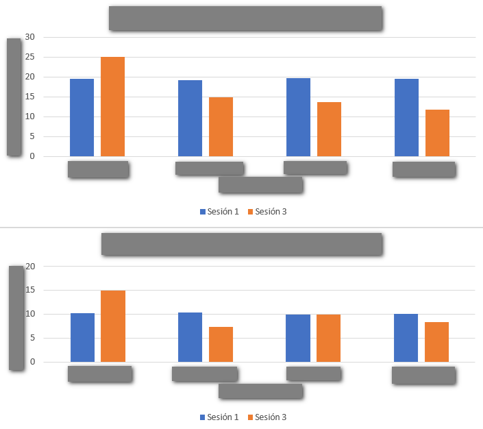{width=80%}

## {data-background-image="assets/intro.jpg" data-background-opacity="0.18"}

{width=80%}

## {data-background-image="assets/intro.jpg" data-background-opacity="0.18"}

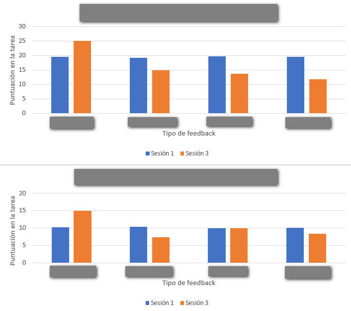{width=80%}

## {data-background-image="assets/intro.jpg" data-background-opacity="0.18"}

{width=80%}

## {data-background-image="assets/intro.jpg" data-background-opacity="0.18"}

{width=80%}

## {data-background-image="assets/intro.jpg" data-background-opacity="0.18"}

{width=80%}

## La evaluación como algo objetivo {data-background-image="assets/intro.jpg" data-background-opacity="0.18"}

{width=60%}

## A mí eso no me pasa, soy justo y objetivo {data-background-image="assets/intro.jpg" data-background-opacity="0.18"}

> Dada la función $f(x)=\cfrac{x^2}{4-x}$ , calcula sus extremos relativos.

Arnal-Bailera, Muñoz-Escolano, & Oller-Marcén (2016) dieron a calificar tres respuestas a una muestra de 91 profesores, de forma que:

- Los métodos aparecen en libros de texto y los dos primeros son muy utilizados por estudiantes en las PAU.
- No presentan ninguna incorrección matemática manifiesta.
- En las tres respuestas se obtiene la solución correcta.
- El nivel de argumentación de las tres respuestas es similar.

## Método 1 {data-background-image="assets/intro.jpg" data-background-opacity="0.18"}

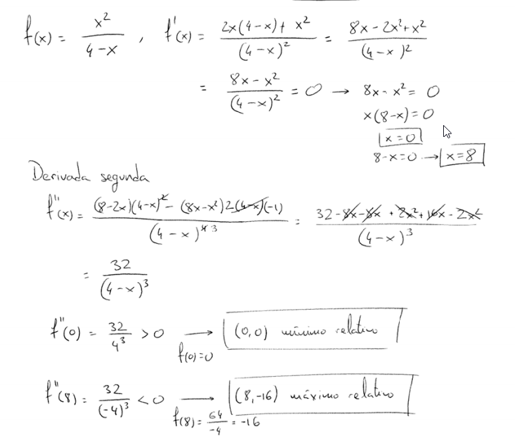{width=65%}

Fuente: Arnal-Bailera, Muñoz-Escolano, & Oller-Marcén (2016)

## Método 2 {data-background-image="assets/intro.jpg" data-background-opacity="0.18"}

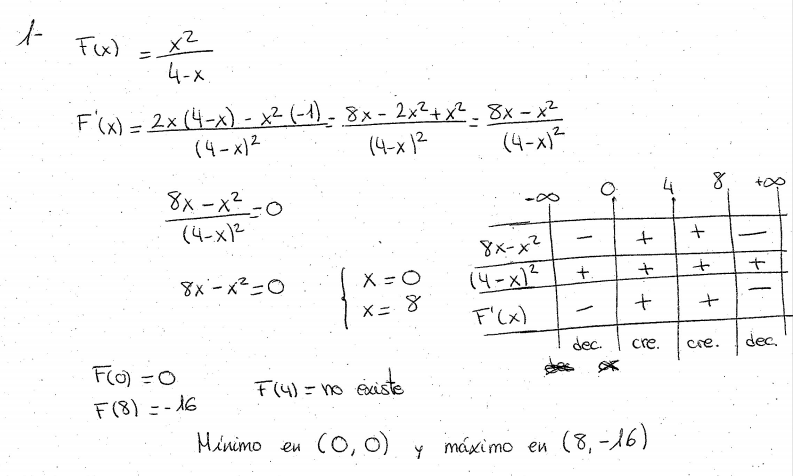{width=80%}

Fuente: Arnal-Bailera, Muñoz-Escolano, & Oller-Marcén (2016)

## Método 3 {data-background-image="assets/intro.jpg" data-background-opacity="0.18"}
 
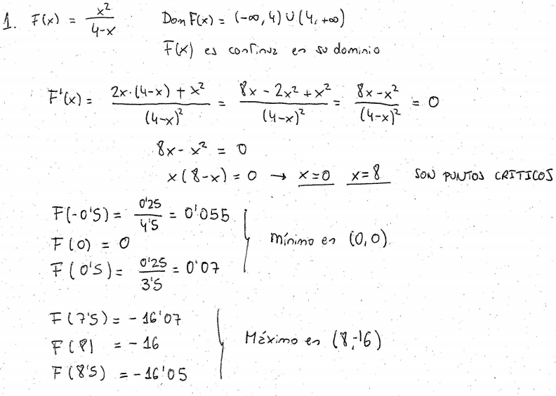{width=80%}

Fuente: Arnal-Bailera, Muñoz-Escolano, & Oller-Marcén (2016)

## Muestra {data-background-image="assets/intro.jpg" data-background-opacity="0.18"}

> Compuesta por 91 profesores de matemáticas (en ejercicio y en formación)

- 26 profesores en formación que cursaron el Máster del Profesorado (Matemáticas).
- 45 profesores de ESO y Bachillerato de 14 centros educativos aragoneses y con diferentes años de experiencia.
- 20 profesores de universidad, matemáticos de formación que imparten o han impartido clase en licenciaturas y grados de matemáticas.

## Resultados {data-background-image="assets/intro.jpg" data-background-opacity="0.18"}

- Conglomerado 1. Puntúan bajo el método 2 y el método 3. Solamente dan por totalmente correcto el método 1.
- Conglomerado 2. Puntúan alto los tres métodos propuestos. Concentra algo más de la mitad de los profesores.
- Conglomerado 3. Puntúan bajo el método 3 y puntúan alto los métodos 1 y 2. Reúne la tercera parte de los profesores.

## Resultados {data-background-image="assets/intro.jpg" data-background-opacity="0.18"}

:::incremental

- Método 1: No se observan diferencias estadísticamente significativas entre las calificaciones otorgadas por los distintos colectivos.
- Método 2: se puede afirmar (nivel de confianza del 99%) que el profesorado de universidad otorga una calificación mayor que los profesores en formación. Aunque la nota media otorgada por el profesorado de ESO también es mayor que la de los profesores en formación, esta diferencia no resulta ser significativa. No hay diferencias entre el profesorado de ESO y el de Universidad. 
- Método 3: el profesorado de universidad otorga calificaciones mayores (nivel de confianza del 95%) que los otros dos colectivos. Los profesores en formación otorgan mayores calificaciones (nivel de confianza del 90%) que el profesorado de ESO.
- Pobre fiabilidad interjueces.
:::

## En los profesores de secundaria {data-background-image="assets/intro.jpg" data-background-opacity="0.18"}

> Tres grupos de profesores en base a sus comentarios, según la argumentación empleada por el alumno, la corrección matemática de la respuesta y la concordancia entre el método empleado y el esperado. 

1. Elevada exigencia de argumentación, proporciona las calificaciones más bajas. 
2. Considera adecuadas la argumentación y la corrección matemática de los tres métodos, muestra un ligero sesgo en contra de la respuesta del método 3. 
3. Clara penalización a la respuesta del método 3.

## Otros resultados {data-background-image="assets/intro.jpg" data-background-opacity="0.18"}

:::incremental
- En cuanto a los años de experiencia docente en secundaria, aunque se aprecian diferencias entre cada conglomerado, estas no han resultado ser estadísticamente significativas.
- La calificación otorgada por gran parte de los correctores es mayor cuando se utilizan métodos más cercanos al modo de hacer y a la experiencia docente del corrector.
- En muchos casos no hacen explícita esta preferencia y ofrecen distintas justificaciones.
- Algunos correctores señalan que el método elegido no es *matemáticamente correcto* lo cual no es cierto y apuntaría a un déficit de conocimiento matemático por parte del corrector. 
- Otros, aun admitiendo la corrección y la adecuación del método, exigen una mayor argumentación en la respuesta que no suele ser exigida cuando otro estudiante opta por un método esperado por el corrector.
:::

## Modelo a tercios {data-background-image="assets/intro.jpg" data-background-opacity="0.18"}

Estos autores, y sus colaboradores, se han preocupado por la cuestión de la corrección de exámenes. 

{width=40%}

Fuente: Gairín, Muñoz-Escolano, Oller-Marcén (2012)

# A través {data-background-image="assets/clase.jpg" data-background-opacity="0.18"}

## Empezamos con situaciones-problema {data-background-image="assets/clase.jpg" data-background-opacity="0.12"}

:::incremental
1. Laura se llevó sus cromos al colegio para jugar varias partidas. En la primera perdió 9 cromos y en la segunda ganó 7 cromos. ¿Cuántos cromos le quedaron después de jugar?
2. Un tren sale de Zaragoza con cierto número de pasajeros y llega a Barcelona después de hacer dos paradas. En la primera parada, bajan 15 y suben 12 pasajeros; en la segunda parada, bajan 38 y suben 42 pasajeros. ¿Con cuántos pasajeros llegó el tren a Barcelona?
:::

##

3. Completa las tablas siguientes sobre el número de pasajeros del tren anterior

| Número de pasajeros que sale de Zaragoza 	| Número de pasajeros que llega a Barcelona 	|
|:----------------------------------------:	|:-----------------------------------------:	|
| 427                                      	|                                           	|
| 1582                                     	|                                           	|
| a                                        	|                                           	|

##

| Número de pasajeros que sale de Zaragoza 	| Número de pasajeros que llega a Barcelona 	|
|:----------------------------------------:	|:-----------------------------------------:	|
|                                          	|                     45                    	|
|                                          	|                    876                    	|
|                                          	|                     c                     	|

Fuente: Cid (2015)

## Interpretación de puntos {data-background-image="assets/clase.jpg" data-background-opacity="0.12"}

¿Quién está representado por cada punto del diagrama?

:::::::::::::: {.columns}

::: {.column width="49%"}

{width=80%}  

:::

::: {.column width="49%"}

{width=90%}  

:::
:::::::::::::

Fuente: Materiales del Shell Centre (Swan, 1989).

## Interpretación de puntos {data-background-image="assets/clase.jpg" data-background-opacity="0.12"}

En el escaparate de una papelería hay cinco cajas de rotuladores, A, B, C, D y E de varios tamaños (12, 24 y 36 rotuladores) y precios (2 €, 4 € y 6 €). La gráfica describe las características de las cajas:

- ¿Qué caja sale a mejor precio?
- ¿Qué caja sale a peor precio?

{width=60%}  

## ¿Qué es enseñar a través de la resolución de problemas? {data-background-image="assets/clase.jpg" data-background-opacity="0.12"}

:::::::::::::: {.columns}

::: {.column width="25%"}

{width=100%}

:::

::: {.column width="70%"}

- Sintetizando mucho, este enfoque consiste en utilizar problemas (en sentido amplio, tareas o situaciones-problema) de los que emerge el contenido matemático. 
- Mediante el trabajo en pequeños grupos y las posteriores puestas en común, el docente proporciona un andamiaje para profundizar en dichos contenidos, siempre a partir de los significados personales del alumnado.

:::

::::::::::::::

## Guía para las discusiones de aula {data-background-image="assets/clase.jpg" data-background-opacity="0.12"}

- Ser sobre todo un **moderador** o **facilitador**.
- Ser ocasionalmente un **interrogador** o **provocador**.
- Nunca ser un **juez** o **evaluador**.

Fuente: Swan (1989).

## ¿Qué es enseñar a través de la resolución de problemas? {data-background-image="assets/clase.jpg" data-background-opacity="0.12"}

:::::::::::::: {.columns}

::: {.column width="45%"}

{width=100%}

:::

::: {.column width="45%"}

{width=100%}

:::

::::::::::::::

## Reflexiones en torno a la evaluación y calificación {data-background-image="assets/observation.jpg" data-background-opacity="0.12"}

:::::::::::::: {.columns}

::: {.column width="45%"}

> El curso 19/20 (pre-confinamiento) seguíamos un sistema de evaluación y calificación que buscaba empoderar el trabajo de aula. 

Aquí las reflexiones (después del confinamiento).

[Hilo en Twitter](https://twitter.com/pbeltranp/status/1280969703419269120)

[Versión blog](https://tierradenumeros.com/post/hilo-evaluacion-calificacion-propuesta/)

:::

::: {.column width="45%"}

{width=100%}

50% exámenes

50% trabajo de aula (exámenes de cuaderno, observación, pasaporte de tareas)

:::

::::::::::::::

## Nuestra preocupación y la estrategia seguida {data-background-image="assets/clase.jpg" data-background-opacity="0.12"}

> ¿Cómo mantener activo al alumnado? ¿Cómo seguir trabajando la capacidad de indagación? ¿Cómo seguir desarrollando esa **actitud matemática**?

- Agrupación por nivel. 
	- Una clase virtual para todo 1º ESO y otra clase virtual para todo 2º ESO.
	- Oportunidad para la codocencia.

## Nuestra preocupación y la estrategia seguida {data-background-image="assets/clase.jpg" data-background-opacity="0.12"}

- Una videoconferencia conjunta para planificar una semana de trabajo y otra para discutir las producciones que habían enviado los alumnos y preparar la puesta en común.
- Puestas en común: se reservaron los jueves como día para una videoconferencia donde se interactuaba con los alumnos. 
- Tareas semanales y autoevaluaciones. Después de cada videoconferencia, los alumnos hacían reentrega final de lo ya hecho, y recibían nuevas tareas, entre ellas, completar la autoevaluación. 

## Producciones del alumnado {data-background-image="assets/observation.jpg" data-background-opacity="0.12"}

{width=100%}

## Atención a la diversidad {data-background-image="assets/observation.jpg" data-background-opacity="0.12"}

En una de las actividades, se trata de averiguar el circuncentro de algunos cuadriláteros: cuadrado, rectángulo, trapecio isósceles, trapecio rectángulo.

El del trapecio rectángulo no se puede hacer, claro, si trazas las mediatrices no se cortan en el mismo punto. 
Una alumna realizó la siguiente observación:

{width=80%}

## Atención a la diversidad {data-background-image="assets/observation.jpg" data-background-opacity="0.12"}

En clase presencial puedes animar a los alumnos a realizar este tipo de observaciones, eligiendo bien las preguntas. Por eso nos alegramos de ver esto en formato online. Le preguntamos que cómo podía estar segura de lo que decía y que se animara a utilizar las herramientas de geogebra.

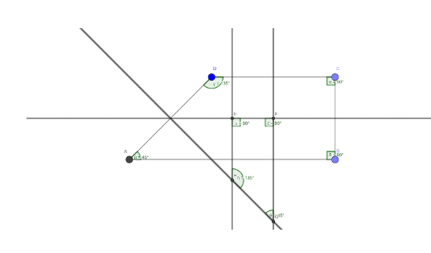{width=50%}

Después, le propusimos pensar acerca del porqué de que ocurra, que implica propiedades de la mediatriz y de ángulos, así como aspectos de perpendicularidad y semejanza.

## Las autoevaluaciones, el eje de la práctica {data-background-image="assets/observation.jpg" data-background-opacity="0.12"}

1. Necesito más tiempo para entender esto o necesito un ejemplo delante para poder hacerlo
2. Puedo hacer esto por mi cuenta, pero hay cosas que no entiendo, me falta una explicación y/o estoy cometiendo errores de cálculo.
3. Puedo hacer esto por mi cuenta sin errores y explicar o mostrar cómo lo resolví.
4. Puedo hacer esto por mi cuenta sin errores, explicar o mostrar cómo lo resolví, y explicar qué significa mi solución o hacer alguna observación adicional. 

> Además, tenían que escribir un párrafo donde describían sus dificultades; otro, con lo que aprendieron; y otro, con lo que les gustaría aprender. La autoevaluación **tenía que estar completa**, si no, se devolvía al alumno. 

## Autoevaluaciones: percepción del alumnado {data-background-image="assets/observation.jpg" data-background-opacity="0.12"}

> Esto son dos ejemplos de autoevaluación.

:::::::::::::: {.columns}

::: {.column width="45%"}

{width=100%}

Tarea: Escaleras, super figuras y formas por formas

:::

::: {.column width="45%"}

{width=100%}

Tarea: Pero...¿qué es un cuadrado? (sobre definiciones)

:::

::::::::::::::

## Autoevaluaciones: dificultades {data-background-image="assets/observation.jpg" data-background-opacity="0.12"}

{width=100%}

## Autoevaluaciones: ¿qué he aprendido? {data-background-image="assets/observation.jpg" data-background-opacity="0.12"}

{width=100%}

## Autoevaluaciones: ¿Qué me gustaría aprender? {data-background-image="assets/observation.jpg" data-background-opacity="0.12"}

{width=100%}

## Encuesta final: forma de trabajar {data-background-image="assets/observation.jpg" data-background-opacity="0.12"}

Algunas respuestas del alumnado

:::::::::::::: {.columns}

::: {.column width="45%"}

> Antes de marzo

- Trabajábamos en grupos y así nos podíamos ayudar entre nosotros, y también las dudas que se habían planteado varias veces, se discutían con toda la clase.
- A mi me gustaba mucho porque lo hacíamos todo en equipo y era la única clase que compartíamos nuestra opinión con nuestros compañeros

:::

::: {.column width="45%"}

> Después de marzo

- Se ha intentado hacer como en clase, que sea interactivo y que nos hiciera pensar pero el trabajo ha sido más individual
- Parecido a clase pero más entretenido al usar aplicaciones
- Parecido a lo que hacíamos en clase pero en lugar de comentarlo en grupo, lo teníamos que hacer solos, intentando llegar a las soluciones poco a poco.

:::

::::::::::::::

## Niveles de interacción en el curso 2020/21 {data-background-image="assets/observation.jpg" data-background-opacity="0.12"}

> Queda pendiente analizar el impacto educativo. Hasta ahora, la percepción es que este alumnado interactúa y presenta una actitud más proactiva ahora que a principios del curso pasado. 

- Ahora es imposible trabajar en mesas enfrentadas y/o agrupadas, por lo que hay que interactuar a distancia. 
- Parejas o grupos de cuatro alumnos, tal y como están sentados habitualmente.
- Ayuda de una pizarrita blanca para enseñar lo que se está haciendo.

# Una propuesta de evaluación y calificación {data-background-image="assets/horizon.jpg" data-background-opacity="0.22"}

## Matemáticas en el CPI Val de la Atalaya {data-background-image="assets/horizon.jpg" data-background-opacity="0.18"}

La evaluación será, en su mayor parte, de carácter formativo, y tendrá lugar de forma continua. Los procedimientos de evaluación, con sus instrumentos, son:

- Observación del trabajo del alumnado
	- Listas de control.
	- Diario de aula,
- Evaluación de las producciones del alumnado: 
	- Tareas generales de aula, 
	- Tareas específicas de evaluación 
	- Tareas específicas para evaluar el cuaderno de trabajo.
- Entrevista personal
	
## Observación del trabajo del alumnado {data-background-image="assets/horizon.jpg" data-background-opacity="0.18"}

:::::::::::::: {.columns}

::: {.column width="30%"}

- Listas de control. Permiten registrar la observación de actitudes y competencias concretas.
- Diario de aula, a modo de registro anecdótico.

:::

::: {.column width="65%"}

{width=100%}

:::

::::::::::::::
	

## Tareas generales de aula {data-background-image="assets/horizon.jpg" data-background-opacity="0.18"}

- Durante las tareas generales de aula, el docente lleva a cabo una evaluación formativa, comentando individualmente, en grupos o con toda la clase, las tareas realizadas. 
- Sobre estas tareas se realizan autoevaluaciones, en las que el alumnado marca su percepción sobre el grado de cumplimiento de los objetivos de la tarea, especificando cuáles son sus dificultades y si ha realizado observaciones adicionales. 

## Ejemplo de autoevaluación general {data-background-image="assets/horizon.jpg" data-background-opacity="0.18"}

:::::::::::::: {.columns}

::: {.column width="50%"}

{width=100%}

:::

::: {.column width="50%"}

{width=100%}

:::

::::::::::::::

## Ejemplo de autoevaluación general {data-background-image="assets/horizon.jpg" data-background-opacity="0.18"}

{width=100%}

## Tareas específicas de evaluación {data-background-image="assets/horizon.jpg" data-background-opacity="0.18"}

:::incremental

- Se realizan de forma individual y se relacionan con los objetivos y estándares de aprendizaje. 
- En tiempo de clase, siendo recogidas por el docente, quien las revisa para preparar una sesión donde las comenta con el alumnado, señalando diversas formas de abordar las tareas, observaciones interesantes y errores más comunes. 
- Las tareas comentadas se guardan escaneadas de forma digital, lo que constituye una evidencia de aprendizaje, y se devuelven físicamente a los alumnos el día de la sesión de comentarios, para que ellos puedan realizar anotaciones. 
- Más adelante, y dependiendo de los resultados de aprendizaje, se planteará una **reelaboración** en clase de esas mismas tareas, que podrán incluir pequeños cambios. Esta reelaboración irá acompañada de su pertinente autoevaluación, lo que permitirá constatar el avance en el proceso de aprendizaje.

:::

## Autoevaluaciones {data-background-image="assets/horizon.jpg" data-background-opacity="0.18"}

:::::::::::::: {.columns}

::: {.column width="45%"}

{width=100%}

:::

::: {.column width="45%"}

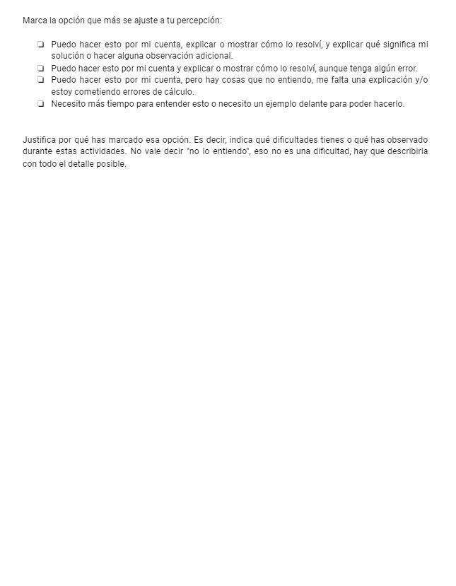{width=100%}

:::

::::::::::::::

## Autoevaluaciones {data-background-image="assets/horizon.jpg" data-background-opacity="0.18"}

Un ejemplo de rúbrica de autoevaluación es el siguiente:

- Necesito más tiempo para entender esto o necesito un ejemplo delante para poder hacerlo.
- Puedo hacer esto por mi cuenta, pero hay cosas que no entiendo, me falta una explicación y/o estoy cometiendo errores de cálculo.
- Puedo hacer esto por mi cuenta y explicar o mostrar cómo lo resolví, aunque tenga algún error. 
- Puedo hacer esto por mi cuenta, explicar o mostrar cómo lo resolví, y explicar qué significa mi solución o hacer alguna observación adicional.

## Autoevaluaciones {data-background-image="assets/horizon.jpg" data-background-opacity="0.18"}

- Para que la autoevaluación sea válida, el alumno debe explicitar las dificultades que ha tenido, así como esas observaciones adicionales. 
- Es el profesor el que corrobora esas autoevaluaciones para que se ajusten a la realidad del alumno. 
- Estas autoevaluaciones se ponen en común con toda la clase, lo que busca fomentar el desarrollo de estrategias metacognitivas.

{width=50%}

## Ejemplo de autoevaluación específica {data-background-image="assets/horizon.jpg" data-background-opacity="0.18"}

:::::::::::::: {.columns}

::: {.column width="50%"}

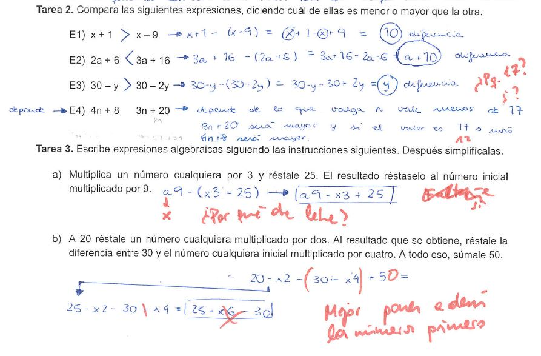{width=100%}

:::

::: {.column width="50%"}

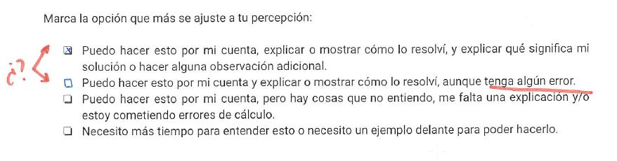{width=100%}

:::

::::::::::::::

## Ejemplo de autoevaluación específica {data-background-image="assets/horizon.jpg" data-background-opacity="0.18"}

:::::::::::::: {.columns}

::: {.column width="50%"}

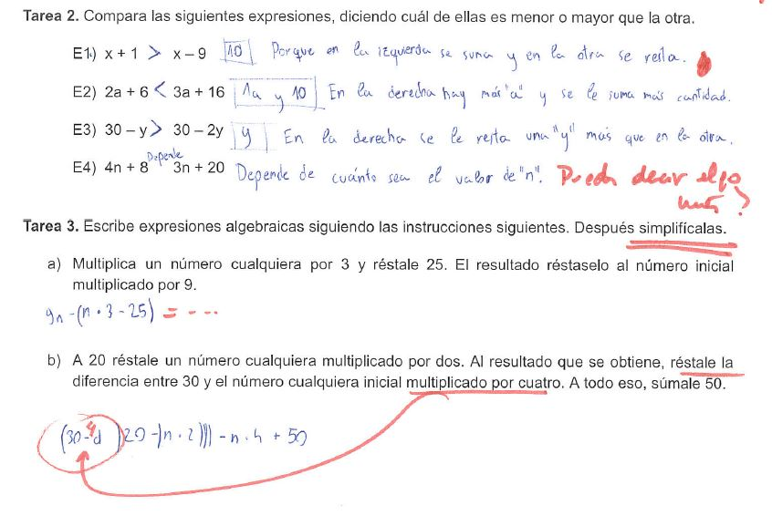{width=100%}

:::

::: {.column width="50%"}

{width=100%}

:::

::::::::::::::

## Tareas específicas de evaluación de cuaderno {data-background-image="assets/horizon.jpg" data-background-opacity="0.18"}

- Igual que las anteriores, pero se realizan con el cuaderno. 
- Permiten evaluar la utilidad que tiene el cuaderno para el alumno. 
- La única diferencia con la evaluación de tareas específicas es que no se realiza normalmente una reelaboración, ya que se considera que los cambios necesarios se incorporan en el modo de trabajar el cuaderno. 

## Entrevista personal {data-background-image="assets/horizon.jpg" data-background-opacity="0.18"}

:::::::::::::: {.columns}

::: {.column width="60%"}

Cuando existan desviaciones entre las autoevaluaciones y la observación del trabajo del alumnado (junto con las evidencias recogidas en el proceso de revisión de las producciones del alumnado), se plantea la realización de entrevistas personales. 

:::

::: {.column width="30%"}

{width=100%}

:::

::::::::::::::

## Calificación {data-background-image="assets/horizon.jpg" data-background-opacity="0.18"}

:::incremental
- Basada en el grado de cumplimiento de los estándares de aprendizaje evaluables. 
- Como cada unidad didáctica está asociada con un conjunto de estándares, los procedimientos de evaluación que se han mencionado antes permiten atender la cuestión de la calificación a partir de los niveles alcanzados en las sucesivas autoevaluaciones. 
- Como estas autoevaluaciones implican el uso de cuatro niveles de cumplimiento de objetivos y, según la normativa, la calificación es una nota numérica entera entre 1 y 10, es necesario establecer un criterio de conversión.
- No obstante, esta criterio tiene **carácter orientativo**, y se complementará con una **valoración cualitativa** del grado de consecución de los estándares de aprendizaje evaluables, atendiendo a cuáles son mínimos exigibles y cuáles no, especialmente en aquellos casos en los que el alumnado se encuentre entre dos valores. 
:::

## Propuesta completa en Twitter {data-background-image="assets/horizon.jpg" data-background-opacity="0.18"}

También encontraréis todo esto desarrollado en Twitter y en mi blog. 

[Hilo en Twitter](https://twitter.com/pbeltranp/status/1322861015676182528)

[Versión blog](https://tierradenumeros.com/post/hilo-evaluacion-calificacion-propuesta-completa/)

{width=30%}

# Créditos y referencias {data-background-image="assets/credits.jpg" data-background-opacity="0.1"}

## Lista de referencias {data-background-image="assets/credits.jpg" data-background-opacity="0.1"}

Arnal-Bailera, A., Muñoz-Escolano, J. M., & Oller-Marcén, A. M. (2016). Caracterización de las actuaciones de correctores al calificar pruebas escritas de matemáticas. *Revista de Educación, 371*, 35-60.[Enlace](http://www.educacionyfp.gob.es/dam/jcr:0ceb64aa-a0cc-4424-92b6-543f068d0923/revista-371-esp-pdf.pdf#page=35)

Burnett, A. (2019). How to Create a Gradeless Math Classroom in a School That Requires Grades. [Entrada de blog]. [Enlace](https://burnettmath.wordpress.com/2019/07/17/how-to-create-a-gradeless-math-classroom-in-a-school-that-requires-grades-updated-from-original-post/)

Butler, R. (1987). Task-Involving and Ego-Involving Properties of Evaluation: Effects of Different Feedback Conditions on Motivational Perceptions, Interest, and Performance. *Journal of Educational Psychology, 79*(4), 474–482. 

## Lista de referencias {data-background-image="assets/credits.jpg" data-background-opacity="0.1"}

Butler, R. (1988). Enhancing and undermining intrinsic motivation. *British Journal of Educational Psychology, 58*(1), 1-14. 

Cai, J. (2003). What research tells us about teaching mathematics through problem solving. *Research and issues in teaching mathematics through problem solving*, 241-254.

Cid, E. (2015). *Obstáculos epistemológicos en la enseñanza de los números negativos*. Tesis doctoral. Universidad de Zaragoza. [Enlace](http://www.atd-tad.org/documentos/obstaculos-epistemologicos-en-la-ensenanza-de-los-numeros-negativos-tesis-doctoral/)

## Lista de referencias {data-background-image="assets/credits.jpg" data-background-opacity="0.1"}

English, L. D., & Gainsburg, J. (2016). Problem Solving in a 21st-Century Mathematics Curriculum. En L.D. English, & D. Kirshner, *Handbook of international research in mathematics education* (p. 326). New York: Routledge.

Gairín, J.M., Muñoz-Escolano, J.M., Oller-Marcén, A.M. (2012). Propuesta de un modelo para la calificación de exámenes de matemáticas. En A. Estepa, Á. Contreras, J. Deulofeu, M. C. Peñalva, F. J. García y L. Ordóñez (Eds.), *Investigación en Educación Matemática XVI * (pp. 261 - 274). Jaén: SEIEM. [Enlace](http://funes.uniandes.edu.co/11212/1/Gairin2012Propuesta.pdf)

Gaulin, C. (2001). Tendencias actuales de la resolución de problemas. _Sigma, 19_, 51-63. [Enlace](http://www.hezkuntza.ejgv.euskadi.eus/r43-573/es/contenidos/informacion/dia6_sigma/es_sigma/adjuntos/sigma_19/7_Tendencias_Actuales.pdf)

Swan, M. (1989). *El lenguaje de funciones y gráficas*. Shell Centre.[Descargar](https://sede.educacion.gob.es/publiventa/el-lenguaje-de-funciones-y-graficas/pedagogia/1065)

## Créditos {data-background-image="assets/credits.jpg" data-background-opacity="0.1"}

La forma de trabajar durante el confinamiento en el CPI Val de la Atalaya fue presentada en:

Beltrán-Pellicer, P., & Martínez Pérez, A. I. (2020). En busca de la coherencia metodológica en la educación de emergencia. 
*4ª Jornada Pensadero*. Fundación Promaestro. 

## Créditos {data-background-image="assets/credits.jpg" data-background-opacity="0.1"}

*Compartir el conocimiento de forma libre es una buena práctica.*

En estas diapositivas se han utilizado materiales disponibles en abierto y se han citado las fuentes correspondientes. El contenido de la presentación está publicado con licencia Creative Common [CC-BY-SA-4.0](https://creativecommons.org/licenses/by-sa/4.0/legalcode.es), lo que quiere decir que puedes compartirla y adaptarla, citándola y poniendo un enlace a la presentación.

> Siéntete libre de trabajar con este material y de contactar para compartir tus reflexiones.

## {data-background-image="assets/credits.jpg" data-background-opacity="0.1"}

Presentación realizada con  <a href="https://revealjs.com/#/">Reveal.js</a>, <a href="https://pandoc.org/">Pandoc</a>, <a href="https://www.mathjax.org/">MathJax</a> y <a href="https://www.markdownguide.org/">Markdown</a>. El código fuente está disponible en [https://github.com/pbeltran](https://github.com/pbeltran/)

La fuente de las imágenes es propia, salvo las que se ha citado la fuente en su diapositiva y las de dominio público obtenidas en [Unsplash](https://unsplash.com).

